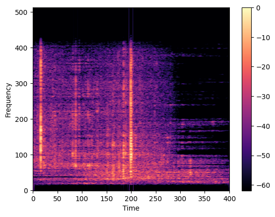
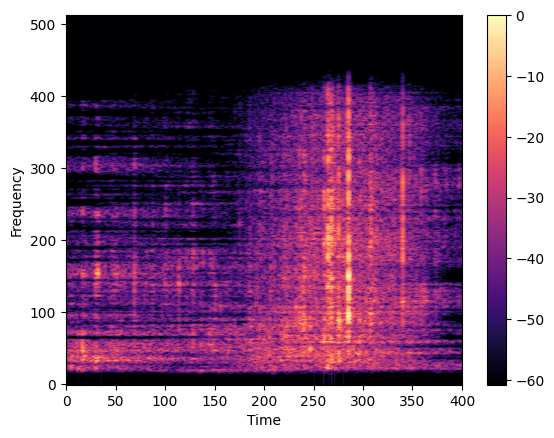

# Biosonar Detection

## Table of Contents

* [About](#about)
* [Contents](#contents)
* [Installation](#installation)
* [Results](#results)
* [Contact](#contact)

<br>

## About
Welcome to our GitHub project dedicated to bioacoustic analysis of echolocation clicks of Odontocetes such as dolphins and whales. This project was developed as part of a Data Challenge proposed by the [Ecole Normale Supérieure](https://challengedata.ens.fr/participants/challenges/85/).

Our analysis focuses on the use of improved sound recording technologies and neural networks to enhance our understanding of inter-species communication and monitor biodiversity health to contribute to ecosystem preservation.

We have developed algorithms based on convolutional neural networks (CNNs) to effectively detect the presence of echolocation click sounds by treating spectrograms as images and passing them through appropriate models.

## Contents
This project contains:
- A folder for notebooks (Audio_extraction.ipynb)
- Reportingd folder containing the report from this project 
- A folder "scripts" with utils and modules containing Audioprocessor (in extractor) + Models (in modeler) and utils
- Env files (explained after)

## Installation
To use this project, you must make the follow commands:
```
git clone https://github.com/luciegaba/Biosonar-detection.
cd Biosonar-detection
```
If you use conda virtual env:
```
conda env create -f environment.yml
conda activate biosonar
```
**To get data, you may need to subscribe to the [Challenge !](https://challengedata.ens.fr/participants/challenges/85/)**


### Data Processing
 We focused on using spectrograms, which are a time-frequency representation of a signal based on signal processing theory. After applying a bandpass filter to select relevant frequencies, we used the short-time Fourier transform (STFT) to create the spectrogram. A Hamming window with a size of 2048 and an overlap of 128 was applied to each audio segment to create the spectrogram. Additionally, we applied adaptive filtering using Wiener decomposition to reduce noise in the audio signal. The resulting spectrograms were then normalized, resized, and converted to a 3-channel RGB representation for use in deep learning models.

 



### Models and performances 

We evaluated the performance of our models using the Area Under the Receiver Operating Characteristic Curve (AUC) metric. Our baseline OdontoceteCNN model achieved an AUC score of 0.89, which is a strong result given the complexity of the task.

While our experiments with more complex architectures like VGG16 and ResNet showed promise, they did not surpass the performance of our baseline OdontoceteCNN model. However, using transfer learning with pre-trained models like VGG16 and MobileNetV2 (pre-trained on ImageNet) could potentially yield better results if further investigated.


| Modèle                                                          | AUC  |
|-----------------------------------------------------------------|------|
| OdontoceteCNN                                                   | 0.89 |
| VGG16                                                           | 0.84 |
| Transfer Learning VGG16 (sur ImageNet)                          | 0.87 |
| Transfer Learning MobileNetV2 (sur ImageNet) + DataAugmentation | 0.56 |

### Contact
* [Lucie Gabagnou👸](https://github.com/luciegaba) - Lucie.Gabagnou@etu.univ-paris1.fr
* [Armand L'Huillier👨‍🎓](https://github.com/armandlhuill) - Armand.lHuillier@etu.univ-paris1.fr
* [Yanis Rehoune👨‍🎓](https://github.com/Yanisreh) - Yanis.Rehoune@etu.univ-paris1.fr
